# NoteQuest

NoteQuest is an AI-powered gamified learning platform that helps students convert their study notes into meaningful concepts and automatically generates adaptive MCQ-based quizzes. The system analyzes uploaded documents, extracts key concepts, and uses an LLM to generate personalized questions based on user progress.

The platform provides:
- Automated concept extraction from notes
- AI-powered DBMS question generation
- Score and level tracking system
- Hint-based learning assistance

---

# Features

- User Authentication System (Signup/Login/Logout)
- Upload Study Notes (PDF, DOCX, TXT)
- Automatic Concept Extraction using NLP
- AI-Based MCQ Generation using Groq LLM
- Adaptive Difficulty System (Level 1–10)
- Score Tracking System
- Hint-Based Learning Support
- Question Caching and Database Fallback
- OCR Support for Scanned Documents
- PostgreSQL Database Integration
- Gamified Learning Experience

---

# Tech Stack

## Frontend
- HTML5
- CSS3
- JavaScript

## Backend
- Python (Flask)

## Database
- PostgreSQL

## AI / NLP
- Groq LLM (LLaMA 3.1)
- YAKE Keyword Extraction

## Document Processing
- PyPDF / pdfminer.six
- python-docx
- Tesseract OCR
- pdf2image

---

# System Architecture

NoteQuest follows a modular architecture:

1. **User Module**
   - Authentication and session management

2. **File Processing Module**
   - Extracts text from uploaded files
   - Applies OCR if needed

3. **Concept Extraction Module**
   - Extracts DBMS-related keywords using YAKE

4. **AI Question Generator**
   - Uses Groq LLM to generate MCQs
   - Stores generated questions in database

5. **Game Engine**
   - Handles scoring, levels, hints, and progression

---


---

# Database Setup

## 1. Create Database

```sql
CREATE DATABASE notequest;
\c notequest;
```

## 2. Run Schema

Execute:
```
psql -U postgres -d notequest -f database.sql
```

# Installation and Setup
## 1. Clone Repository

```
git clone https://github.com/your-username/notequest.git
cd notequest
```

## 2. Install Dependencies

```
pip install -r requirements.txt
```

## 3. Set Environment Variables
Groq API Key
Windows:

```
setx GROQ_API_KEY "your_api_key"
```

## 4. Install OCR Dependencies
Tesseract OCR

Download:
https://github.com/tesseract-ocr/tesseract

Set path in m2.py:
```
pytesseract.pytesseract.tesseract_cmd = r"C:\Program Files\Tesseract-OCR\tesseract.exe"
```

Poppler (PDF Processing)

Download Poppler and set:

```
POPPLER_PATH = r"C:\poppler\Library\bin"
```

## 5. Run Project

```
python app.py
```

Open in browser:
http://localhost:8000

# How It Works
## 1. Upload Notes
- User uploads PDF/DOCX/TXT
- System extracts text
- Concepts are extracted using NLP
## 2. Concept Processing
- YAKE extracts keywords
- DBMS-related concepts are filtered
- Stored in PostgreSQL per user
## 3. Question Generation
- Concepts are sent to Groq LLM
- MCQs are generated dynamically
- Questions stored in database
## 4. Game Flow
- User answers MCQs
- Correct answer → Score increases + Level up
- Wrong answer → Hint provided
- Progress saved in DB

# Scoring System
- Correct Answer: +10 points
- Level Progression: +1 level per correct answer
- Maximum Level: 10
- Progress stored in PostgreSQL


# Website Images

## Welcome Page
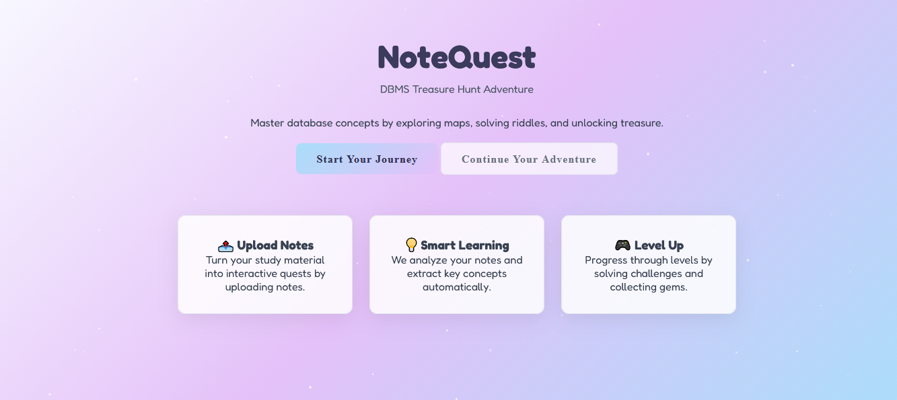

## Signup
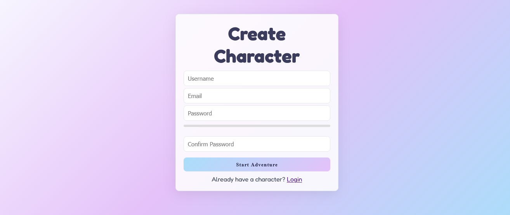
### Invalid Inputs 
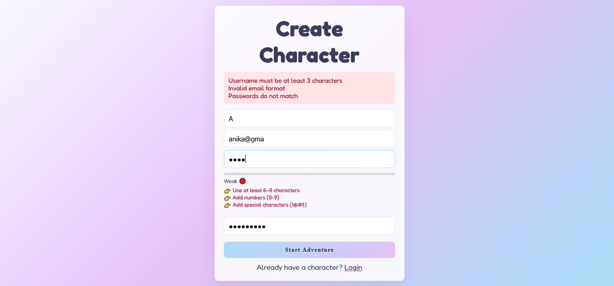
### Valid Inputs 
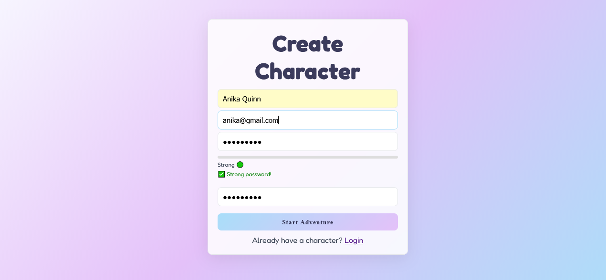

## Login
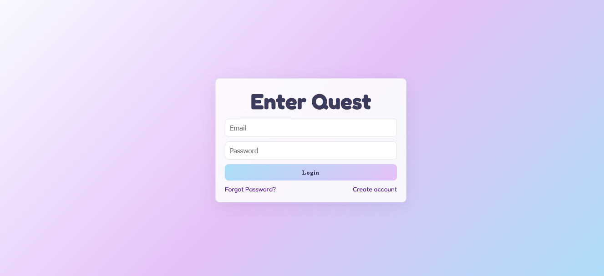
### Invalid Inputs 
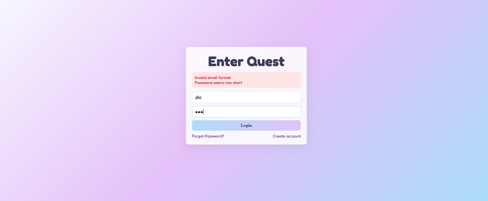
### Valid Inputs 
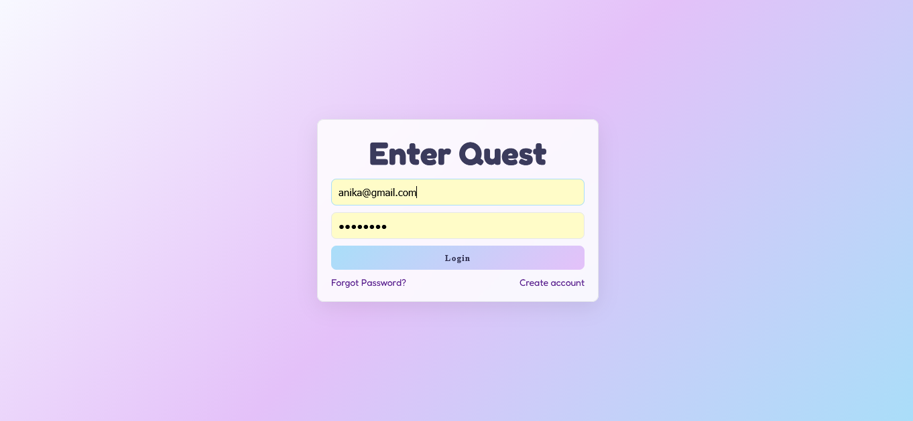

## Forgot Password
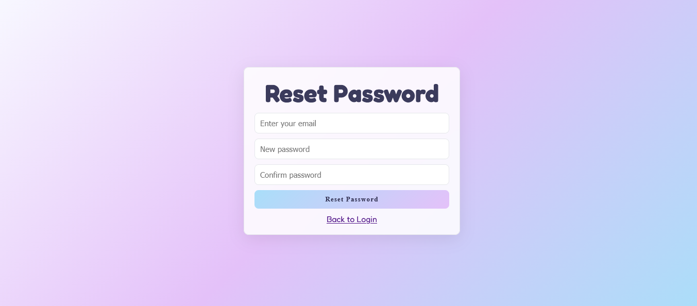
### Invalid Inputs 
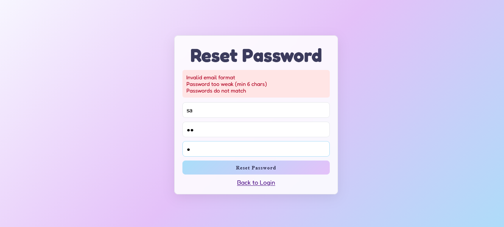
### Valid Inputs 
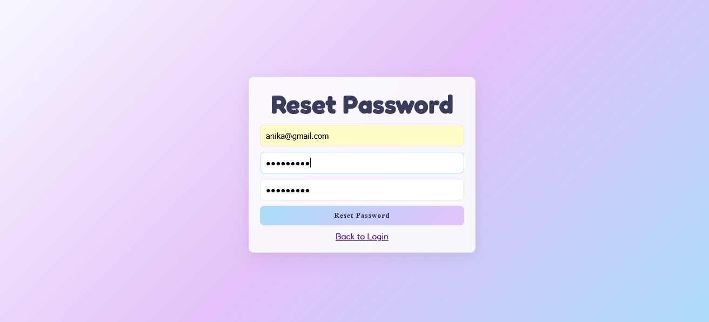

# Dashboard
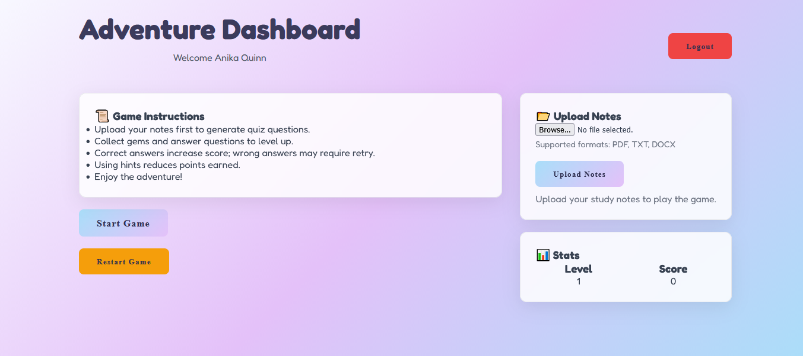

## File upload
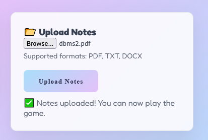

# Game Interface
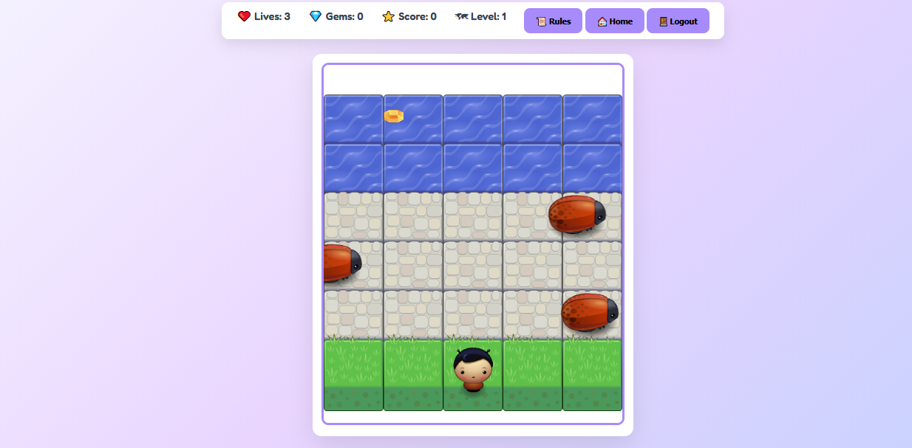

## MCQ
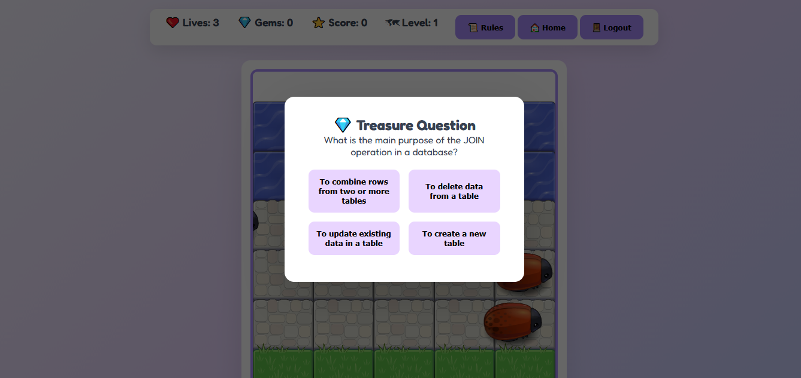

## MCQ (correct answer)
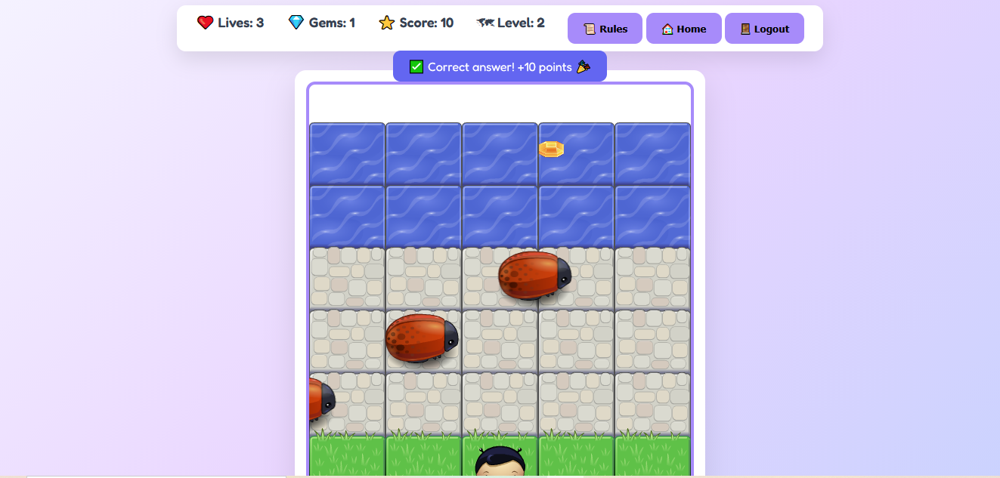

## MCQ (Wrong Answer)
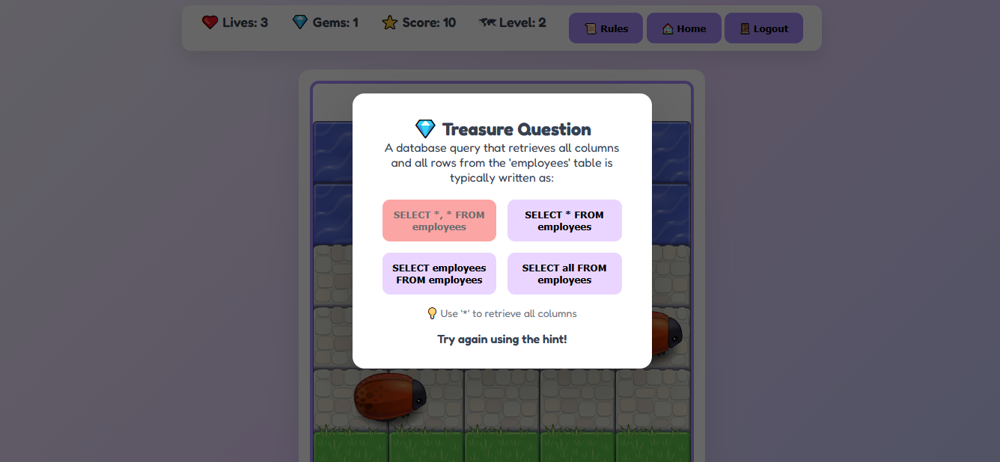

## Game Over
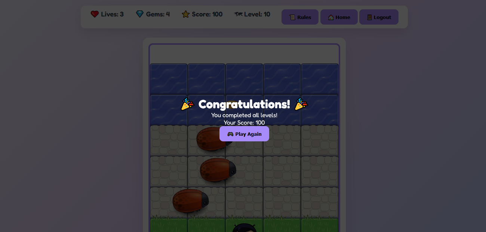


# Team Members
- Esha Gadekar 
- Hussain Esmaeili
- Samantha Fernandes 
